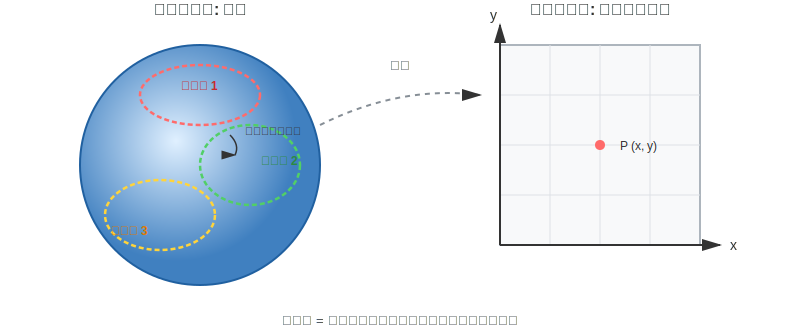
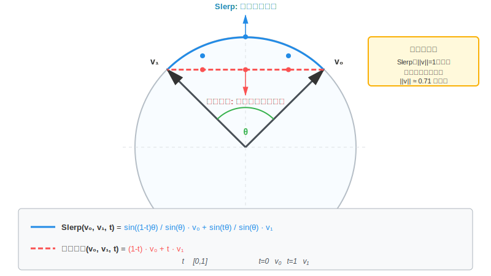
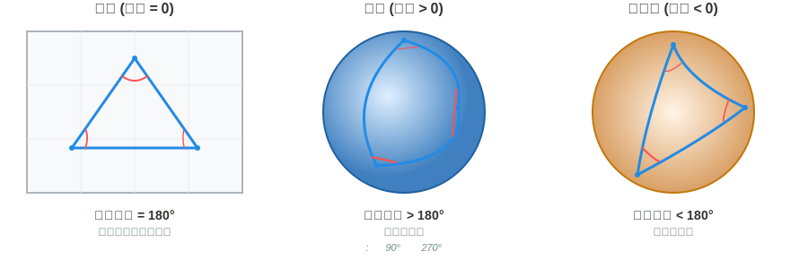
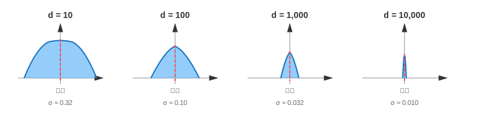

# 第0回：幾何学という言語 ～この講義の羅針盤～

## 注意事項

本回は数学的道具の導入であり、特定のモデルへの適用条件はまだ問わない。
ただし「多様体」「測地線」等の概念を深層学習に適用する際は、各回で改めて「どの条件下で成り立つか」を確認する。

## 導入：なぜ幾何学なのか

深層学習の手法は急速に変化する。2年前の最先端は今日の常識となり、明日には陳腐化するかもしれない。しかし、その背後にある「空間の形」についての問いは、驚くほど普遍的である。

本講義は、個々の手法（How）ではなく、なぜその設計が有効なのか（Why）を問う。その答えを与えるのが **幾何学** という言語である。

幾何学は、空間の「形」を記述する数学だ。平らな紙の上で成り立つ定理が、地球儀の上では崩れる。深層学習の表現空間も同様に、私たちの素朴な直感が通用しない「曲がった空間」であることが多い。この講義では、その曲がり方を理解し、設計に活かすための道具を整える。

## 多様体：局所と大域の二重構造

### 多様体とは何か

**多様体（manifold）** とは、局所的にはユークリッド空間に見えるが、大域的には異なる構造を持つ空間のことである。

最も身近な例は地球である。あなたが立っている地面は、目に見える範囲では平らに見える。しかし、地球全体を見れば、それは球面である。球面全体を、1枚の平面座標（1つの地図）で歪みなく表すことはできない。そのため実際には、地球儀の表面をいくつかの「地図」に分け、互いに重なり合う領域を持たせながら貼り合わせて全体を扱う。

多様体を理解する直感の1つは、 **「存在して良い場所が制限されることで自由度（次元）が下がる」** という見方である。例えば3次元空間内の球面上の点は、常に $x^2 + y^2 + z^2 = r^2$ という方程式に縛られている。この「厚みゼロ」の制約があるため、3次元の中にありながら、自由に動ける方向（次元）は表面に沿った2方向のみに制限される。

これが多様体の本質だ。図1では **「多様体の局所と大域の構造」** を並べて可視化する：



図: 多様体の局所と大域の構造。球面を複数の局所座標系（地図）で分割し、互いに重なり合う領域を持たせながら貼り合わせる。局所的には平坦に見えるが、大域的には曲がっている。

| 視点 | 地球の場合 | 深層学習の表現空間 |
| --- | --- | --- |
| **局所的** | 近所は平らに見える | （滑らかだと仮定すれば）小さな摂動は接空間で線形近似できる |
| **制限（厚み）** | 上下方向への移動が制限される | パラメータ間の依存関係や制約により、実質的な自由度が落ちる |
| **大域的** | 実際は球面 | 全体の構造は非線形で複雑 |

> [!NOTE]
> **多様体とリーマン多様体の区別：** 厳密には、多様体とは「局所的にユークリッド空間と同相」な空間であり、距離や角度は定義されていない。距離・角度・曲率を語るには、リーマン計量を入れた **リーマン多様体** が必要である。深層学習の文脈では、表現空間がユークリッド空間である場合には内積（計量）が自然に入り、埋め込まれた多様体には誘導計量が入るため、両者を厳密に区別しないことが多い。

### 多様体の機能的階層

多様体は、その「滑らかさ」や「測り方」の度合いによって、扱える道具（微分、距離、曲率…）が段階的に増えていく。以下は、本講義で登場する三つの階層である。

| 階層 | 一言でいうと | 扱える道具 | 本講義での登場 |
| --- | --- | --- | --- |
| **位相多様体** (Topological Manifold) | 「つながり」の最小単位 | 連続変形、穴やループの数え上げ | 第14回（TDA） |
| **可微分多様体** (Differentiable Manifold) | 「方向」を語れる（微分できる）空間 | 接空間、微分（differential） | 第8回（Neural ODE）等 |
| **リーマン多様体** (Riemannian Manifold) | 「定規と分度器」を備えた空間 | 距離、角度、測地線、曲率 | 第3回〜第5回（球面）、第12回（双曲空間） |

下に行くほど「構造が豊か」になる。位相多様体はドーナツとコーヒーカップを同一視する世界であり、距離も角度も定義されていない。可微分多様体になると接空間が定まり、関数の微分（differential：近傍での変化を一次で捉える道具）が計算できるようになる——これが勾配降下法の「方向」を語る下地となる。ただし、微分から勾配ベクトル（gradient）を一意に定めるには、さらにリーマン計量が必要である。リーマン計量を入れて初めて、「最短経路はどれか」「空間はどれだけ曲がっているか」を語ることができる。

> [!TIP]
> この階層は「望遠鏡の倍率」のようなものだ。倍率を上げる（構造を追加する）ほど詳細が見えるが、そのぶん前提（滑らかさ、計量の存在など）も重くなる。各回で「今どの階層の話をしているか」を意識すると、議論の射程が明確になる。

### 深層学習に現れる具体的な空間モデル

上の階層が「どのレベルの道具を使えるか」を決めるのに対し、ここでは「どんな形の空間を選ぶか」という種別の話をする。深層学習で頻出する多様体は、大きく分けて以下の三つである。

| 種別 | 主な役割 | 幾何学的特徴 | 本講義での登場 |
| --- | --- | --- | --- |
| **統計多様体** | **「確率分布の形」** を捉える | 各点が確率分布に対応し、フィッシャー情報計量を「定規」とする | 第4回（Softmaxと情報幾何）、Appendix 4–5 |
| **双曲多様体** | **「階層構造」** を埋め込む | 負の曲率を持ち、指数関数的な広がりにより膨大な親子関係を低次元で保存する | 第12回（ポアンカレ円板） |
| **代数多様体** | **学習の特異性**（相転移・汎化）を解析する | 多項式で定義され、**特異点（トゲ）** を持ちうる。学習の相転移や汎化の謎を解く鍵 | Appendix 6（特異学習理論） |

統計多様体は第4回以降の情報幾何学パートで中心的な舞台となる。双曲多様体は第12回で専門的に扱う。代数多様体は本講義の主役ではないが、Appendix 6で紹介する特異学習理論（SLT）の土台であり、「なぜ深層学習は汎化するのか」という根本問題に関わる。

> [!NOTE]
> **階層と種別の関係：** 統計多様体は、パラメトリックモデルが正則（フィッシャー情報行列が正定値）である場合、フィッシャー計量によりリーマン多様体として扱える。双曲多様体も同様にリーマン多様体の一種である。一方、深層学習のモデルでは対称性や冗長性（同じ分布を表すパラメータが複数存在する等）によりフィッシャー情報が退化（半正定値化）しうるし、代数多様体は特異点を持ちうるため、滑らかさを前提とする可微分多様体やリーマン多様体の枠組みにはそのままでは収まらない。この「はみ出し」こそが、Appendix 6で扱う特異学習理論の出発点である。

### なぜ多様体が重要か

深層学習において、データは高次元空間に埋め込まれるが、その「意味のある部分」は多くの場合、より低次元の多様体（あるいはそれに近い構造）上に集中している。これを **多様体仮説（manifold hypothesis）** と呼ぶ。

「存在して良い場所」が制限されているということは、データが持つ真の自由度が、見かけ上の次元数よりもはるかに小さいことを意味する。

例えば、顔画像のデータセットを考えよう。各画像は数百万画素のベクトルとして表現されるが、「顔らしさ」を決める自由度（表情、向き、照明など）はせいぜい数十から数百程度である。つまり、顔画像は高次元空間という広大な「体積」の中に、極めて薄く折りたたまれた「低次元の皮（多様体）」として存在していると考えられる。

この構造を理解し、その「皮」に沿った移動や補間を行うことが、表現学習の本質である。

> [!NOTE]
> **多様体仮説の限界：** 多様体仮説は多くの実験的証拠に支持されているが、実データが「厳密な多様体」であるとは限らない。(i) ノイズや離散性により滑らかな多様体にならない、(ii) 局所次元が場所によって変わる、(iii) クラス境界付近で自己交差する、(iv) クラスごとに非連結な“島”になる、などが起こりうる。実務では「多様体」というより **「低次元構造っぽさ」** として捉える方が安全である。後続回では、「多様体と見なせるためにどの仮定が必要か」を明示する。

## 測地線：曲がった空間での「直線」

### 測地線とは何か

平らな空間では、2点間の最短経路は直線である。では、曲がった空間ではどうか。

**測地線（geodesic）** とは、多様体上における「直線」の概念を一般化したものである。直感的には 「ハンドルを切らずに、その空間の歪みに沿って真っ直ぐ進む道」 と言える。地球上（球面）では、これは 大円（great circle）に対応する。東京からニューヨークへの最短航路が地図上で奇妙に曲がって見えるのは、球面上の測地線を平面に投影しているからだ。

| 空間 | 曲率 | 測地線の形 | 例 |
| --- | --- | --- | --- |
| ユークリッド空間 | 0 | 直線（線分） | 紙の上で定規を引く |
| 球面 | 正 | 大円の弧 | 飛行機の最短航路 |
| 双曲空間 | 負 | （モデルによるが）境界に直交する円弧など | 第12回で詳しく扱う |

> [!NOTE]
> **測地線は「最短」とは限らない：**<br>
> 測地線とは、多様体上で「真っ直ぐ進む」ことを一般化した概念であり、『（適切なパラメータ付けのもとで） **長さ** （あるいはエネルギー） **の変分が 0 になる＝「停留点」を満たす曲線**』として定義される。
> さらに物理的には、表面という拘束条件の下でも**内在的にはハンドルを切っていない**運動に対応し、数式では曲線 $\gamma(t)$ の速度 $\dot\gamma(t)$ が自分自身に沿って変化しない $\nabla_{\dot\gamma}\dot\gamma = 0$ （共変加速度が0; 自らの進む方向に速度ベクトルを平行移動させ続ける=曲がらない）という条件で表される。したがって、最短経路であればそれは必ず測地線であるが、 測地線は必ずしも**大域的な最短経路**とは限らない。
>
> **最短性との違い：** <br>
> 球面上の2点を結ぶ測地線は大円の弧で表される。近い2点では短い方の弧が最短だが、同じ「大円に沿って進む」経路でも、区間の取り方によっては**全体として最短でない**測地線がありうる（局所的には“真っ直ぐ”でも、大域的な最短性は保証されない）。
>
> **一意性の喪失：**<br>
> 球面の対蹠点（真裏）に向かう場合、出発点から到達点へ至る**大円が無数に存在**し、それらは同じ長さの測地線になるため、「最短経路」が一意に定まらない。

> [!TIP]
> **用語の省略について**:
> 厳密には「線全体」と「その一部（区間）」は異なる。
> しかしながら、文脈から明らかなら「の弧」を省略して、「測地線（の弧）」は単に「測地線」、「大円（の弧）」は単に「大円」とよぶ。
> 本講義でも、2点間を結ぶ経路を指す場合は、断りがない限り「弧（一部）」のことを指す。

### 深層学習における測地線

表現空間が球面（単位球面上に正規化されたベクトル）として **明示的に設計されている** 場合、2つの表現間の「自然な補間」は測地線に沿って行われるべきである。

単純な線形補間（ユークリッド空間での直線）では、中間点が球面から外れてしまう。これに対し、**球面線形補間（Slerp: Spherical Linear Interpolation）** は、球面上の測地線に沿った補間を与える（Shoemake, 1985）。以下の図で **「球面線形補間（Slerp） vs 線形補間」** を比較する。



図: 球面線形補間（Slerp）と線形補間の比較。Slerpは球面上の測地線（大円）に沿って補間するため、すべての中間点で単位ベクトルのノルムが保たれる。一方、線形補間は球面を突き抜けるため、中間点のノルムが1未満になる。 $t \in [0,1]$ として、Slerpは $\mathrm{Slerp}(v_0, v_1, t)=\frac{\sin((1-t)\theta)}{\sin\theta}v_0+\frac{\sin(t\theta)}{\sin\theta}v_1$ 、線形補間は $(1-t)v_0 + tv_1$ 。Slerpは $||v||=1$ を保つが、線形補間の中点は $||v|| \approx 0.71$ になる。

> [!CAUTION]
> **Slerpが適切なのは「球面制約が設計に組み込まれている場合」に限られる。** 埋め込みが正規化されていない場合、あるいはコサイン類似度を使っていても学習目的が球面幾何と整合しない場合は、Slerpが「意味的に自然な補間」を与える保証はない。「意味の線形性」は幾何というよりタスクや損失関数の設計に依存する。

```00_geodesic_intro.py
import torch


def slerp(v0, v1, t):
    """球面線形補間（Slerp）

    Args:
        v0, v1: 単位ベクトル（正規化済み）
        t: 補間パラメータ（0から1）

    Returns:
        球面上の測地線に沿った補間点
    """
    # 内積からなす角を計算
    dot = torch.clamp(torch.sum(v0 * v1), -1.0, 1.0)
    theta = torch.acos(dot)

    # 特殊ケース：ほぼ同じ方向
    if theta.abs() < 1e-6:
        return v0

    # Slerp公式
    sin_theta = torch.sin(theta)
    return (torch.sin((1 - t) * theta) / sin_theta) * v0 + (torch.sin(t * theta) / sin_theta) * v1
```

> [!CAUTION]
> Slerpは $v_0$ と $v_1$ が反対方向（内積≈-1）のとき数値的に不安定になる。この場合、測地線は一意に定まらない（どの大円でも同じ長さ）。実装では、内積が-1に近い場合の例外処理が必要。

## 曲率：空間の「曲がり具合」

### 曲率とは何か

**曲率（curvature）** は、空間がどれだけ「平ら」から逸脱しているかを定量化する。直感的には、以下のように区別できる：

| 曲率 | 特徴 | 例 | 深層学習での用途 |
| --- | --- | --- | --- |
| **正（positive）** | 三角形の内角の和が180°より大きい | 球面 | 第3回：球面埋め込み |
| **ゼロ（zero）** | 三角形の内角の和がちょうど180° | 平面 | 古典的なユークリッド空間 |
| **負（negative）** | 三角形の内角の和が180°より小さい | 双曲面（鞍型） | 第12回：階層構造の表現 |

### 曲率の直感的理解

球面上で三角形を描いてみよう。北極から赤道上の2点へ線を引くと、赤道上の辺と合わせて「三角形」ができる。この三角形の内角の和は、180°を超える。極端な例では、北極から赤道まで下り、赤道を90°移動し、北極へ戻ると、各角が90°の三角形ができる。内角の和は270°だ。

これが **正の曲率** の特徴である。空間が「膨らんでいる」ために、三角形が「太る」。

逆に、鞍型の曲面（プリングルスの形）では、三角形は「痩せる」。これが **負の曲率** である。図では **「曲率による三角形の違い」** を並べて確認する。



図: 曲率による三角形の違い。平面（曲率=0）では内角の和が180°、球面（曲率>0）では180°より大きく、双曲面（曲率<0）では180°より小さい。

### 曲率と平行移動

曲がった空間のもう一つの特徴は、ベクトルを「平行に」移動しても、元に戻ったときに向きがズレることだ。

地球上で北極に立ち、南を向いた矢印を持っているとしよう。この矢印を「向きを変えずに」赤道まで運び、赤道に沿って90°移動し、北極へ戻る。すると、矢印は最初の向きから90°ズレている。

この「ズレ」の量が曲率を反映している。深層学習の文脈では、表現空間の曲率が学習ダイナミクスに影響を与える（第4回で詳述）。図は **「球面上の平行移動とベクトルの回転」** を示し、北極→赤道→北極の経路で90°回転する様子を描いている。


図: 球面上の平行移動とベクトルの回転。北極→赤道→北極の経路でベクトルを平行移動させると、元の位置に戻ったときに90°回転している。このズレの量が曲率を反映している。球面は曲がっているため、ベクトルを「平行に」移動しても、元の場所に戻ったときに向きがズレる。このズレの量が曲率を反映している。

## リーマン計量：「距離の測り方」を定める

### リーマン計量とは何か

**リーマン計量（Riemannian metric）** は、多様体上で「距離」や「角度」を測るための数学的装置である。より正確には、各点における接空間（その点での「平らな近似」）に内積を定めるものだ。

平らな空間では、距離は単純なユークリッドノルムで測れる：

$$d(\mathbf{x}, \mathbf{y}) = \|\mathbf{x} - \mathbf{y}\| = \sqrt{\sum_i (x_i - y_i)^2}$$

しかし、曲がった空間では「どの方向に進むか」によって距離の測り方が変わりうる。リーマン計量は、この「方向依存の距離感」を定式化する。

### 統計的モデルという名の「多様体」

リーマン計量を深層学習に応用する第一歩は、**確率分布を「点」として捉える**ことにある。

例えば、あるモデルが $n$ 個の独立に動かせるパラメータ $\theta = (\theta_1, \dots, \theta_n)$ を持っているとする。
このとき、この分布の集合は $n$ 次元の多様体 を成し、 $\theta$ はその上の座標系となる。

- **点：** 個々の確率分布
- **座標：** パラメータ
- **空間（多様体）：** パラメータを変化させて得られる全ての分布の集合

この視点に立つと、「モデルの学習」とは **「分布の多様体上を、目的関数が最小となる点に向かって移動するプロセス」** に他ならない。
しかし、この空間で距離を測る際、単なるパラメータの差（ユークリッド距離）を使うと、分布としての本質的な変化量を無視してしまうことになる。

> [!NOTE]
> **「点」の内部構造：スカラから分布へ**<br>
> 情報幾何学では、「点」という概念が多層的な意味を持つ。
>
> 1. **データ空間の点：** 観測された $n$ 個の数値（ベクトル）
> 2. **表現空間の点：** 高次元ベクトルとしての埋め込み（向きと長さ）— Word2VecやTransformerなどの決定論的な中間表現
> 3. **統計多様体上の点：** ある確率分布に対応し、 $\theta$ はその点を指定する座標（パラメータ）
>
> 最も驚くべきは第3の視点である。統計多様体の各点は、**ある確率分布** $p(x; \theta)$ に対応している。
> ここで重要なのは、**「確率分布** $p$ **こそが幾何学的な実体（主役）」** であり、パラメータ $\theta$ はその点を指し示すための **「単なる番地（座標）」** に過ぎないという点だ。
>
> 番地の付け方（座標系）が変わっても、そこに存在する場所（分布の性質）は変わらない。情報幾何学は、パラメータという「番地」の選び方に左右されない、分布そのものの本質的な幾何学構造を扱おうとする。
> この「座標系の取り方に依存しない性質」は、より正確には **再パラメータ化不変性** （reparameterization invariance）と呼べる。
> 座標（パラメータ）を変えると成分表示は変わるが、同じ幾何学的対象を記述している、という意味である。

> [!CAUTION]
> 本文で扱う統計多様体は、 $\theta$ によって表せる有限次元の分布族（パラメトリックモデル）を想定しており、次元は通常パラメータ数に等しい。「無限次元」というのは、分布が関数として持つ豊かさの比喩的表現であり、この文脈での多様体の次元そのものを指すものではない（※ノンパラメトリックに分布全体を扱う情報幾何も別途存在する）。
>
> ユークリッド空間の点が「位置」だけを持つのに対し、統計多様体の点は「起こりうる全ての事象に対する確率の配分」という、はるかに豊かな構造を代表している。この視点転換が、情報幾何学の出発点である。
>
> 詳細は [Appendix 4「空間の物差し再考」](appendix_4.md) を参照。

### フィッシャー情報行列

では、この曲がった空間での正しい『ものさし』はどう定義されるのか?
つまり、確率分布の空間で、パラメータ $\theta$ で決まる分布 $p(x; \theta)$ の「近さ」をどう測るのか?

素朴にはパラメータ空間でのユークリッド距離 $\|\theta_1 - \theta_2\|$ を使いたくなる。しかし、これは問題がある。同じパラメータの「幅」でも、分布の変化量は異なるからだ。

例えば、正規分布 $N(\mu, \sigma^2)$ で、 $\mu$ を0.1動かすのと、 $\sigma$ を0.1動かすのでは、分布の「見た目」の変化量が全く違う。

**フィッシャー情報行列（Fisher Information Matrix）** は、この「分布の変化しやすさ」を反映したリーマン計量を与える：

$$g_{ij}(\theta) = \mathbb{E}_{p(x;\theta)}\left[\frac{\partial \log p(x;\theta)}{\partial \theta_i} \frac{\partial \log p(x;\theta)}{\partial \theta_j}\right]$$

この計量を使えば、パラメータ空間での「1歩」が、分布空間での「同じ大きさの変化」に対応するようになる。

## 情報幾何学：確率分布の多様体

### 甘利俊一の情報幾何学

**情報幾何学（Information Geometry）** は、確率分布の空間を多様体として扱う学問である。甘利俊一によって体系化され、統計学・機械学習・物理学に広く応用されている。

その核心的なアイデアは：

> **確率分布の空間にリーマン計量を入れると、統計的推論が幾何学的な言葉で記述できる。**

具体的には：

| 統計的概念 | 幾何学的解釈 |
| --- | --- |
| 最尤推定 | 多様体への射影 |
| KLダイバージェンス | 非対称な「距離」（ブレグマンダイバージェンス） |
| 自然勾配 | リーマン計量に沿った勾配 |
| 十分統計量 | 多様体の座標系の選び方 |

### 自然勾配と学習の効率

通常の勾配降下法は、パラメータ空間でのユークリッド勾配を使う。しかし、パラメータの「1歩」が分布の「どれだけの変化」に対応するかは、現在地によって異なる。

**自然勾配（Natural Gradient）** は、フィッシャー情報行列を使って勾配を補正することで、分布空間での「等しい変化量」を実現する（Amari, 1998）：

$$\tilde{\nabla}_ \theta \mathcal{L} = G(\theta)^{-1} \nabla_ \theta \mathcal{L}$$

ここで $G(\theta)$ はフィッシャー情報行列。

直感的には、「地形に応じて歩幅を調整する」ようなものだ。急な坂（分布が敏感に変わる方向）では小さく、緩やかな坂（分布があまり変わらない方向）では大きく歩く。

> [!NOTE]
> **「自然勾配」とは、多様体における本来の勾配のこと**<br>
> 数学的には、リーマン計量が定まった多様体において「勾配」は一意に定義される。
> それにもかかわらず、深層学習においてわざわざ「自然勾配」と呼称するのは、多くの場面で **「多様体の曲がりを無視した、パラメータ上の数値的な勾配」** が使われているからだ。
> 「自然（Natural）」という言葉には、人間が便宜的に決めたパラメータの表現形式（座標系）に依存せず、
> 確率分布という対象そのものが持つ幾何学的な構造から導かれる **「本来あるべき勾配」** である、という意味が込められている。

> [!NOTE]
> 自然勾配の計算は、フィッシャー情報行列の逆行列を必要とするため、大規模モデルでは直接計算が困難である。Adam（Kingma & Ba, 2015）等の適応的オプティマイザは、勾配の2次モーメントを座標ごとに正規化する「前処理付き勾配法」であり、特定の仮定のもとで自然勾配に **似た形** になることがある。ただし、両者は同一ではなく、「Adam＝自然勾配の近似」と言い切るのは過剰主張である。

### 本講義の立ち位置

本講義は、情報幾何学の精神を受け継ぎつつ、深層学習の具体的な幾何構造に焦点を当てる。特に：

- **球面**（第3回〜第5回）：正規化された表現空間
- **双曲空間**（第12回）：階層構造の表現
- **位相**（第14回）：形ではなく「穴」を測る

これらは、情報幾何学の一般論というより、実践的な設計指針として扱う。

## 本講義の地図：平坦から曲がった世界へ

### 三つの世界

本講義は、表現空間の「形」を軸に、以下の三つの世界を旅する：

```txt
平坦（古典的な機械学習）→ 球面（現代の深層学習）→ その先（双曲・トポロジー）
```

| 世界 | 曲率 | 典型的な手法 | 講義での位置 |
| --- | --- | --- | --- |
| **平坦** | ゼロ | PCA, SVM, Word2Vec（初期） | 第1回〜第2回 |
| **球面** | 正 | nGPT, ArcFace, CLIP | 第3回〜第7回 |
| **双曲** | 負 | Poincaré Embedding, HypLoRA | 第12回 |
| **位相** | - | TDA, Persistent Homology | 第14回 |

> [!NOTE]
> **表の分類軸について：** ここでの「球面」「双曲」は、**表現空間の設計において明示的にその幾何構造が導入されている** ことを指す。例えばnGPTは単位球面上での正規化を明示的に行い、Poincaré Embeddingは双曲空間での埋め込みを前提とする。ただし、これらの手法が「本質的に」その幾何を必要とするかどうかは議論の余地がある。各回で、何が幾何学的制約であり何がそうでないかを区別する。

### 連続と離散の界面

深層学習には、避けて通れない緊張がある。
それは、ニューラルネットワーク内部での連続空間における「旅」が、 **最終的には必ず離散的なトークンや決定という「地表」に着地** しなければならないという点だ。

モデルの内部では、あらゆる概念は高次元のベクトル（連続値）として、無限のグラデーションの中に浮かんでいる。
しかし、我々がモデルに求めるのは「次にくる単語は『猫』である」という明確な一択、つまり離散的な回答である。
Softmaxは、連続的なロジットを確率分布に変換する。Attentionは、連続的な類似度を重みに変換する。これらの操作は、連続と離散の界面で起きている。

例えば、翻訳モデルが「Apple」という単語を日本語に翻訳する際、内部では「リンゴ（果物）」と「アップル（企業）」の間で連続的な重みの引き合いが起きている。
最終的に出力されるのはどちらか一方の離散的な単語だが、その決定の直前まで、モデルは連続的な確率分布をもっている。

第4回では、この界面をSoftmaxと情報幾何学の観点から再検討する。

### スパース性：高次元空間の「ほとんどが空」

高次元空間には、直感に反する性質がある。第13回で詳しく扱うが、ここで予告しておこう：

> 高次元空間では、ランダムに選んだ2つのベクトルは、ほぼ確実に直交に近い。



図: 高次元空間でのランダムベクトルの直交性。単位球面上の一様ランダムベクトルの内積分布は、次元dが大きくなるほど0に集中する（標準偏差 ≈ 1/√d）。次元が上がるほど、ランダムベクトルはほぼ直交する。

> [!NOTE]
> **理論的背景：** 単位球面上の一様ランダムベクトル $v_1, v_2$ の内積 $v_1 \cdot v_2$ の分布は、平均が0（対称性）で、標準偏差は $\sigma \approx 1/\sqrt{d}$ 。次元 $d$ が大きくなるほど内積は0に集中し、結果として「高次元空間ではランダムベクトルはほぼ直交する」。

この性質は、呪いにも祝福にもなりうる。

- **呪い**：距離の区別がつきにくくなる（kNNの困難）
- **祝福**：互いに干渉しない表現を大量に詰め込める可能性

Mixture of Experts（MoE）は、高次元空間を活用するアーキテクチャの一例である。各Expertが異なる部分空間を担当し、入力に応じて適切なExpertだけを活性化する（疎な活性化）。

> [!IMPORTANT]
> **MoEの設計原理の中心は「直交性」ではない。** MoEが成立する主な要因は、(1) 条件付き計算（疎な活性化）による計算効率、(2) 容量分割によるパラメータ効率、(3) ルーティング学習の安定化技術、である（Shazeer et al., 2017; Fedus et al., 2022）。高次元での直交性は「Expert間の干渉が起きにくい」という **直感の補助** にはなるが、MoEの本質を幾何だけで説明することはできない。

## 幾何学の限界：形は測れても、正しさは測れない

### 本講義が扱わないこと

ここで、重要な限界を明示しておく。

幾何学は「空間の形」を測る道具だが、**「その空間に注ぎ込まれたデータの真偽」** については沈黙している。

例えば、「1+1=2」と「1+1=3」の埋め込みベクトルは、どちらも正規化すれば単位球面上の点になる。幾何学的には、両者は単に「異なる方向を向いた単位ベクトル」に過ぎない。どちらが「正しい」かは、幾何学の範疇外である。

| 幾何学が見るもの | 真偽判定に必要なもの |
| --- | --- |
| 距離・曲率・位相（内在的性質） | 世界知識・論理規則・観測事実（外部参照） |

この限界については、[Appendix 2「多様体の純度問題」](appendix.2.md) で詳しく議論する。

> [!IMPORTANT]
> 正規化は「形式の安定」を与えるが、「内容の真偽」には中立である。幾何学に真偽判定を期待するのは、定規に善悪の判断を期待するようなものだ。

### 外部参照の必要性

現時点で、データの真偽を判定するには、幾何学の外にある道具が必要である：

- **Tool Use**：計算エンジンや検索エンジンで事実を検証
- **合成データ**：論理エンジンで「正しい」データを生成
- **人手ラベリング**：人間が「良い/悪い」を判定

これらはいずれも「幾何学的手法」ではない。本講義は、幾何学が解決できる問題と、解決できない問題を区別することを重視する。

## 続編への接続：静的から動的へ

本講義「統一視点」は、**空間の形**（どこに配置されているか）を扱う。しかし、深層学習には「形」だけでは捉えられない側面がある。**情報がどう流れるか**（どう移動するか）という動的な視点だ。

続編「動態論」では、この動的な視点を導入する：

| 講義 | 問い | 主語 | 典型的な対象 |
| --- | --- | --- | --- |
| 統一視点（本講義） | 空間の形は何か | 表現（embedding） | 球面、双曲空間、情報幾何 |
| 動態論（続編） | 情報はどう流れるか | 軌道（trajectory） | 拡散、フロー、推論過程 |

例えば、拡散モデルは「ノイズからデータへの旅」を記述する。この旅を理解するには、**連続の式**（質量保存）、**速度場**（どの方向に流れるか）、**作用**（どの経路が最適か）といった、流体力学の言葉が必要になる。

動態論の第0回では、これらの道具を導入する。本講義で「空間の形」を理解した後、続編で「情報の流れ」を学ぶことで、深層学習の幾何学的な全体像が見えてくる。

## まとめ

| 概念 | 定義 | 深層学習での役割 |
| --- | --- | --- |
| **多様体** | 局所的に平坦、大域的に曲がった空間 | 表現空間の構造を記述 |
| **測地線** | 曲がった空間での「最短経路」 | 表現間の自然な補間（Slerp等） |
| **曲率** | 空間の曲がり具合の定量化 | 正規化・埋め込み設計の指針 |
| **リーマン計量** | 距離・角度の測り方 | 自然勾配、学習ダイナミクスの理解 |
| **情報幾何学** | 確率分布を多様体として扱う | Softmax、KL、温度の幾何学的解釈 |

### ゴール

**数式は後から付いてくる。まずは「幾何学的直感」を獲得する。**

この講義を通じて獲得してほしいのは、以下のような問いを自然に発することができる直感である：

- 「この表現空間は、どんな形をしているのか」
- 「この正規化は、空間をどう変形しているのか」
- 「この距離関数は、何を『近い』と定義しているのか」
- 「この手法の本質は、幾何学的に何をしているのか」

### 次回予告

第1回「かつての地図」では、古典的な機械学習が前提としていたユークリッド空間観を振り返る。PCA、SVM、LDAといった手法が、いかに「平らな世界」を暗黙の前提としていたかを確認し、見落とされていた構造の兆しを掘り起こす。

## 実装ノート：幾何学的直感を検証する

> [!NOTE]
> 以下のコードは PyTorch >= 1.9 を前提とする。再現性のために `torch.manual_seed(42)` 等でシードを固定することを推奨。

### 高次元での直交性の確認

高次元空間でランダムベクトルがほぼ直交することを、実験で確認しよう：

<details>
<summary>コード例: 00_random_orthogonality.py</summary>

```00_random_orthogonality.py
import torch


def check_random_orthogonality(dims, n_pairs=1000):
    """高次元でランダムベクトルの内積分布を調べる"""
    results = []

    for d in dims:
        # 単位球面上の一様ランダムベクトル
        v1 = torch.randn(n_pairs, d)
        v1 = v1 / v1.norm(dim=1, keepdim=True)
        v2 = torch.randn(n_pairs, d)
        v2 = v2 / v2.norm(dim=1, keepdim=True)

        # 内積の計算
        dots = (v1 * v2).sum(dim=1)
        results.append({"dim": d, "mean": dots.mean().item(), "std": dots.std().item()})

    return results


# 実験
dims = [10, 100, 1000, 10000]
results = check_random_orthogonality(dims)

for r in results:
    print(f"d={r['dim']:5d}: mean={r['mean']:+.4f}, std={r['std']:.4f}")

# 期待される結果：
# d=   10: mean≈0, std≈0.32
# d=  100: mean≈0, std≈0.10
# d= 1000: mean≈0, std≈0.032
# d=10000: mean≈0, std≈0.010
# → 次元が上がると標準偏差が 1/√d で減少
```

</details>

### 測地線（Slerp）と線形補間の違い

<details>
<summary>コード例: 00_slerp.py</summary>

```00_slerp.py
import torch


def slerp(v0, v1, t):
    """球面線形補間"""
    dot = torch.clamp(torch.sum(v0 * v1), -1.0, 1.0)
    theta = torch.acos(dot)
    if theta.abs() < 1e-6:
        return v0
    sin_theta = torch.sin(theta)
    return (torch.sin((1 - t) * theta) / sin_theta) * v0 + (torch.sin(t * theta) / sin_theta) * v1


def lerp(v0, v1, t):
    """線形補間（正規化なし）"""
    return (1 - t) * v0 + t * v1


def lerp_normalized(v0, v1, t):
    """線形補間して正規化"""
    v = (1 - t) * v0 + t * v1
    return v / v.norm()


# 3次元で可視化
v0 = torch.tensor([1.0, 0.0, 0.0])
v1 = torch.tensor([0.0, 1.0, 0.0])
ts = torch.linspace(0, 1, 20)

slerp_points = torch.stack([slerp(v0, v1, t) for t in ts])
lerp_points = torch.stack([lerp(v0, v1, t) for t in ts])
lerp_norm_points = torch.stack([lerp_normalized(v0, v1, t) for t in ts])

# 結果：
# - slerp_points: 球面上の大円に沿った点列
# - lerp_points: 球面を突き抜ける直線（中点でノルム≈0.71）
# - lerp_norm_points: slerpとほぼ同じ（この場合）
```

</details>

> [!NOTE]
> 2点間の角度が小さい場合、Slerpと正規化付き線形補間の差は小さい。角度が大きくなると差が顕著になる。

## 参考文献

### 情報幾何学・リーマン幾何学（数学的基礎）

- Amari, S. (2016). *Information Geometry and Its Applications*. Applied Mathematical Sciences, Vol. 194. Springer Japan. DOI: [10.1007/978-4-431-55978-8](https://doi.org/10.1007/978-4-431-55978-8)
    - 情報幾何学の標準的教科書。フィッシャー情報行列、自然勾配、双対構造などを体系的に扱う。
- Amari, S. (1998). Natural Gradient Works Efficiently in Learning. *Neural Computation*, 10(2), 251–276. DOI: [10.1162/089976698300017746](https://doi.org/10.1162/089976698300017746)
    - 自然勾配の一次文献。パラメータ空間の計量構造が学習効率に与える影響を示した古典。
- Lee, J. M. (2018). *Introduction to Riemannian Manifolds* (2nd ed.). Graduate Texts in Mathematics, Vol. 176. Springer. DOI: [10.1007/978-3-319-91755-9](https://doi.org/10.1007/978-3-319-91755-9)
    - リーマン幾何学の標準的教科書。測地線、曲率、平行移動などの厳密な定義を参照できる。
    - 著者公式ページ（正誤表・補足）: [https://sites.math.washington.edu/~lee/Books/RM/](https://sites.math.washington.edu/~lee/Books/RM/)

### 多様体仮説

- Fefferman, C., Mitter, S., & Narayanan, H. (2016). Testing the Manifold Hypothesis. *Journal of the American Mathematical Society*, 29(4), 983–1049. DOI: [10.1090/jams/852](https://doi.org/10.1090/jams/852)
    - 多様体仮説を理論的にテストする立場の代表的論文。
    - arXiv版: [arXiv:1310.0425](https://arxiv.org/abs/1310.0425) (2013)

### 幾何学的深層学習（サーベイ）

- Bronstein, M. M., Bruna, J., Cohen, T., & Veličković, P. (2021). Geometric Deep Learning: Grids, Groups, Graphs, Geodesics, and Gauges. *arXiv:2104.13478*.
    - 幾何学的深層学習の統一的サーベイ。対称性・不変性・同変性の観点から深層学習を俯瞰する。
    - Proto-book（章立て・図版が充実）: [https://geometricdeeplearning.com/](https://geometricdeeplearning.com/)

### 最適化（Adam・自然勾配との関係）

- Kingma, D. P., & Ba, J. (2015). Adam: A Method for Stochastic Optimization. *ICLR 2015*. arXiv: [arXiv:1412.6980](https://arxiv.org/abs/1412.6980) (2014).
    - Adamオプティマイザの一次文献。本文で「自然勾配に似た形になることがある」と述べた際の参照先。

### Mixture of Experts（MoE）

- Shazeer, N., Mirhoseini, A., Maziarz, K., Davis, A., Le, Q., Hinton, G., & Dean, J. (2017). Outrageously Large Neural Networks: The Sparsely-Gated Mixture-of-Experts Layer. *ICLR 2017*. arXiv: [arXiv:1701.06538](https://arxiv.org/abs/1701.06538).
    - 現代的なMoEの基礎論文。スパースゲーティングと条件付き計算の設計を導入。
- Fedus, W., Zoph, B., & Shazeer, N. (2022). Switch Transformers: Scaling to Trillion Parameter Models with Simple and Efficient Sparsity. JMLR, 23(120), 1–39. (arXiv:[arXiv:2101.03961](https://arxiv.org/abs/2101.03961), 2021)
    - MoEの訓練安定化技術（Load Balancing Loss等）を扱う。本文で「MoEの設計原理の中心」として言及した内容の参照先。

### 球面補間（Slerp）

- Shoemake, K. (1985). Animating Rotation with Quaternion Curves. *SIGGRAPH '85 Proceedings*, 245–254. DOI: [10.1145/325334.325242](https://doi.org/10.1145/325334.325242)
    - 球面線形補間（Slerp）の古典的文献。四元数の文脈で導入されたが、一般の単位球面にも適用可能。
