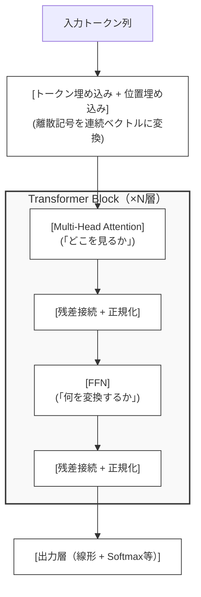

# 第6回：Transformerという測量士 ～動的な接続～

## 注意事項

- 標準Transformerの $Q, K$ は単位ノルム化されていない。LayerNorm/RMSNormは平均・分散の正規化であり、 $L_2$ 正規化（単位ノルム化）とは別物である。
- したがって、標準Transformerで「 $Q^\top K = \cos\theta$ 」は成り立たない（ノルムの影響が混在する）。
- 「球面上のAttention」解釈が厳密に成り立つのは、Cosine AttentionやnGPTなど明示的に $L_2$ 正規化する設計の場合に限られる。
- それでも「角度的な見方」は、正規化設計を理解するための導線として有用である。

## Transformerの全体像

Transformerの構成要素を手短に整理し、各要素が本講義のどこで幾何学的に再解釈されるかを示す。

### 構成要素

Transformerは、以下の要素が積み重なった構造である。1ブロック（層）の処理を簡略化すると、次のようになる：



各要素の役割を簡潔に述べると次のようになる。

| 要素 | 役割 | 一言で言えば | 本講義との対応 |
| --- | --- | --- | --- |
| **トークン埋め込み** | 離散トークンを $d$ 次元ベクトルに変換 | 「記号を空間に配置する」 | 第2回（ノルム）、第3回（球面） |
| **位置埋め込み** | トークンの順序情報を付与 | 「星に座標を与える」 | 第6回（RoPE：本回） |
| **Multi-Head Attention** | 入力に応じてトークン間の関係を動的に計算 | 「望遠鏡で星空を測量する」 | 第6回（本回）、第4回（Softmax：情報幾何学） |
| **FFN（Feed-Forward Network）** | 各トークンの表現を非線形に変換 | 「観測データを処理する」 | 第8回（ベクトル場） |
| **残差接続** | 入力をショートカットで加算し、勾配の流れを安定させる | 「元の情報を保持しながら更新する」 | 第8回（Neural ODE） |
| **正規化（LayerNorm等）** | 表現のスケールを安定させる | 「計器のキャリブレーション」 | 第3回（nGPT） |
| **出力層** | タスクに応じた最終変換（分類ならSoftmax等） | 「測量結果を報告する」 | 第5回（ArcFace） |

> [!IMPORTANT]
> **AttentionとFFNの分業：** Attentionは「トークン間の情報交換（どの情報を集めるか）」を担い、FFNは「各トークンの表現変換（集めた情報をどう加工するか）」を担う。この分業構造がTransformerの基本設計である。第3回で見たnGPTは、この両方の出力に球面制約を課す設計だった。また、近年のMoE（Mixture of Experts）ではFFN部分を動的に切り替える設計も登場している（第13回で触れる）。

> [!NOTE]
> **Encoder-DecoderとDecoder-only：** Transformerには大きく分けてEncoder-Decoder型（T5など）とDecoder-only型（GPTなど）がある。上の構成要素は両者に共通する。本講義では特定のアーキテクチャに限定せず、共通する幾何学的構造に注目する。Decoder-onlyモデルでは、Attentionに因果マスク（未来のトークンを見ない制約）が加わるが、幾何学的な本質は変わらない。

## 導入：静的な地図から動的な測量へ

第1回で見たように、古典的な機械学習手法は「固定された特徴空間」を前提としていた。PCAは固定された主成分軸を、SVMは固定されたカーネル関数を使う。入力が何であれ、空間の構造は変わらない。

Transformerは、この前提を根本から覆した。

Attention機構は、入力に応じて「どこを見るか」を動的に決定する。これは、固定された地図を読む代わりに、その場で測量を行うようなものだ。入力が変われば、測量結果も変わり、空間の見え方自体が変化する。

本回では、このAttention機構を幾何学的に再解釈する。特に、正規化の有無が解釈にどう影響するかを明確にしながら、Query-Key-Value機構の本質に迫る。

## カーネル法の限界：固定された特徴空間

### カーネル法とは何だったか

第1回で触れたカーネル法を、もう少し詳しく振り返ろう。

カーネル法は、データを高次元の特徴空間に写像し、その空間で線形な操作を行う。カーネル関数 $k(\mathbf{x}, \mathbf{y})$ は、この高次元空間での内積を直接計算する：

$$k(\mathbf{x}, \mathbf{y}) = \langle \phi(\mathbf{x}), \phi(\mathbf{y}) \rangle$$

RBFカーネル $k(\mathbf{x}, \mathbf{y}) = \exp(-\gamma \|\mathbf{x} - \mathbf{y}\|^2)$ は「近いものは類似度が高い」という直感を反映し、多項式カーネルは特徴の交互作用を捉える。

### 固定性という制約

カーネル法の根本的な制約は、**特徴空間の構造が入力に依存しない**ことである。

RBFカーネルは常に「ユークリッド距離に基づく類似度」を計算する。入力がテキストであろうと画像であろうと、同じ関数形を使う。これは、すべての入力に対して同じ「地図」を適用しているようなものだ。

| カーネル法 | Attention |
| --- | --- |
| 固定された特徴空間 | 入力依存の動的な空間 |
| 事前に設計されたカーネル関数 | 学習されたQuery-Key-Value |
| 入力に関わらず同じ構造 | 入力ごとに異なる重み付け |

## Attention機構：動的な測量システム

### Query-Key-Valueの直感

Attention機構を理解するために、**測量**のメタファーを導入しよう。

測量士は、未知の地形を測定するために、複数の基準点との距離や角度を測る。その測定結果を統合して、自分の位置や地形の構造を推定する。

Attention機構も同様のことを行う：

- **Query（問い）**：「私は今、何を知りたいのか」という測量士の意図
- **Key（鍵）**：各基準点が「自分はここにいる」と示す標識
- **Value（値）**：各基準点が持つ情報の内容

測量士（Query）は、各標識（Key）との整合度を計算し、整合度が高い基準点（Value）からより多くの情報を取り入れる。

### 標準Transformerの計算ステップ

標準的なTransformerのSelf-Attentionは、以下のステップで計算される。

**Step 1: 線形射影**

入力 $\mathbf{X} \in \mathbb{R}^{n \times d}$ を、学習された重み行列で射影する：

$$\mathbf{Q} = \mathbf{X} W_Q, \quad \mathbf{K} = \mathbf{X} W_K, \quad \mathbf{V} = \mathbf{X} W_V$$

**Step 2: Scaled Dot-Product Attention**

QueryとKeyの内積を計算し、スケーリングする：

$$\text{Attention}(\mathbf{Q}, \mathbf{K}, \mathbf{V}) = \text{softmax}\left(\frac{\mathbf{Q} \mathbf{K}^\top}{\sqrt{d_k}}\right) \mathbf{V}$$

$\sqrt{d_k}$ はKey・Queryの次元数の二乗根で、これによるスケーリングは、内積の分散を安定させるためのものである。

> [!IMPORTANT]
> **標準TransformerとL2正規化の違い：** 標準Transformerでは、LayerNormやRMSNormが使われるが、これらは **平均・分散の正規化** であり、ベクトルを単位ノルムにする **L2正規化とは異なる**。したがって、 $\mathbf{Q}^\top \mathbf{K}$ は純粋な角度情報（ $\cos\theta$ ）ではなく、**方向と大きさの両方の影響を受ける**。

> [!NOTE]
> **高次元でのLayerNormの挙動：** ただし、高次元空間においてLayerNormを適用されたベクトルは、確率的に「ある程度の範囲のノルムに集中する」傾向がある（高次元の集中現象の一種）。そのため、標準Attentionでも「実質的には角度に近いものを見ている」という近似的解釈は、現場の直感としては完全に間違いではない。本資料では厳密な区別を維持しつつ、角度的な見方を正規化設計への導線として位置づけている。

### 球面解釈が成り立つ条件

「Attentionは角度を計算している」という解釈は、特定の条件下でのみ厳密に成り立つ。

**条件：** $\mathbf{Q}$ と $\mathbf{K}$ の各行ベクトルが単位ノルムに正規化されている場合、

$$\mathbf{q}_i ^\top \mathbf{k}_j = \|\mathbf{q}_i\| \|\mathbf{k}_j\| \cos\theta _{ij} = \cos\theta _{ij}$$

となり、内積は純粋に角度情報を反映する。

| 設計 | L2正規化 | 内積の意味 |
| --- | --- | --- |
| 標準Transformer | なし | 方向 + 大きさの混合 |
| Cosine Attention | Q, Kを正規化 | 純粋な角度（ $\cos\theta$ ） |
| nGPT | すべて正規化 | 純粋な角度（ $\cos\theta$ ） |

> [!NOTE]
> **それでも幾何学的解釈は有用：** たとえ厳密に $\cos\theta$ でなくても、内積は「方向の類似性」の指標として機能する。正規化設計（Cosine Attention, nGPT）を理解するための導線として、角度的な見方は有用である。

## 天体観測メタファー：QKVの再解釈

### なぜ「辞書」ではなく「天体観測」か

Attention機構の説明として、「Queryは検索クエリ、Keyはインデックス、Valueは内容」という**辞書メタファー**がよく使われる。これは初期のメモリネットワークや、エンジニアに馴染み深いKey-Valueストアからの類推である。

しかし、この比喩には限界がある。辞書は「AならB」という1対1の対応を前提とするが、Attentionは**連続的な類似度**に基づいて**すべてのValueを混合**する。

より適切なメタファーとして、**天体観測**を提案する。

### 星空としてのトークン列

トークン列を、宇宙に浮かぶ星々として捉えよう。

**Key（星の輝き・色）**：各トークンが「自分は何者か」を周囲に示す特性。星が特定の波長の光を放つように、各トークンは自身の意味的特性をKeyとして発信する。

**Value（星の質量・組成）**：各トークンが持つ情報のエネルギー。Attentionによって選ばれたとき、この情報が伝達される。

**Query（望遠鏡の向きとフィルター）**：観測者が「今、何を探しているか」という意図。特定の波長だけを通すフィルターをセットして、夜空を見渡す行為に相当する。

**Attention Score（光の受信）**：観測者のフィルター（Query）と星の輝き（Key）が一致したとき、その星は強く輝いて見える。Softmaxによって、特に明るい星々が選び出され、意味のある「星座」として認識される。

### 辞書メタファーとの本質的な違い

天体観測メタファーは、辞書メタファーでは説明しにくい現象を自然に捉える。

**1. 完全一致ではなく空間の重なり**

辞書検索は「リンゴ」を探して、あればその情報を返す。Attentionは、Queryという「方向」に対して、各Keyがどれだけ「重なって見えるか」を連続的に計算する。

**2. 文脈による「歪み」の許容**

「彼はペンを持った」と「彼は自信を持った」では、「持った」の意味が異なる。辞書は「持った」という項を引くだけだが、Attentionでは周囲のトークンの影響で空間が「歪み」、同じ単語でも異なる座標が観測される。

**3. 情報の統合は加重和**

辞書は「一つの正解」を取り出すが、Attentionは測量したすべてのKeyの重みに基づいて、Valueを混ぜ合わせる。周囲との関係性の総和として意味が定義される。

> [!NOTE]
> **ハルシネーションの幾何学的理解：** 辞書観では「検索ミス」としか理解できないハルシネーションも、天体観測観では「観測データの密度が低い領域で、Attentionが変な方向に歪み、存在しない星（意味）を観測してしまった」と理解できる。これは「空間の歪みをどう補正するか」という本質的な議論への入口を開く。

## Multi-head Attention：複数の視点

### なぜ複数のヘッドが必要か

Single-head Attentionは、一つの「見方」しか持たない。しかし、言語には複数の側面がある。文法的な関係、意味的な関係、照応関係など、異なる種類の関係を同時に捉える必要がある。

**Multi-head Attention**は、この問題に対処するために、複数の独立したAttentionを並列に実行する：

$$\text{MultiHead}(\mathbf{Q}, \mathbf{K}, \mathbf{V}) = \text{Concat}(\text{head}_1, \ldots, \text{head}_h) W_O$$

$$\text{head}_i = \text{Attention}(\mathbf{Q} W_Q^i, \mathbf{K} W_K^i, \mathbf{V} W_V^i)$$

### 幾何学的解釈：部分空間への射影

各ヘッドは、異なる射影行列 $W_Q^i, W_K^i, W_V^i$ を持つ。これは、高次元空間を異なる部分空間に射影し、それぞれの部分空間でAttentionを計算することに相当する。

天体観測メタファーで言えば、**複数のフィルターを通して同じ星空を観測**するようなものだ。可視光、赤外線、X線など、異なる波長で観測すると、異なる構造が見える。Multi-head Attentionは、意味空間を複数の「波長」で同時に観測している。

| 観点 | Single-head | Multi-head |
| --- | --- | --- |
| 視点の数 | 1つ | $h$ 個 |
| 捉えられる関係 | 1種類 | 複数種類 |
| 部分空間 | 全空間 | $h$ 個の部分空間 |
| 表現力 | 限定的 | 豊か |

> [!NOTE]
> **LDAとの比較（比喩として）：** 第1回で触れたLDA（Linear Discriminant Analysis）は、固定されたトピック空間への射影を行う。Multi-head Attentionは、入力ごとに変化する「見方」の集合を学習するという意味で、LDAの動的・連続版と見なせる。ただし、これは直感的な比喩であり、最適化問題として同一ではない。

> [!NOTE]
> Mixture of Experts (MoE) との比較は[第13回](13.md)で行う。

## RoPE：回転による相対位置の表現

### 位置情報の必要性

Self-Attentionは、入力の順序を区別しない。「犬が猫を追いかけた」と「猫が犬を追いかけた」は、単語の集合としては同じだが、意味は異なる。位置情報を何らかの形で導入する必要がある。

初期のTransformer（Vaswani et al., 2017）は、正弦波による **絶対位置埋め込み** を使った。しかし、近年の大規模言語モデル（Llama, Qwen, Mistral等）では、**RoPE（Rotary Position Embedding）** が広く採用されている。

> [!NOTE]
> **位置埋め込みの多様性：** RoPEは近年の多くのLLMで採用されているが、唯一の選択肢ではない。ALiBi（Press et al., 2022）のように、Attention重みに位置依存のバイアスを加える方式の採用例もある。最適な位置埋め込みはタスクやモデル設計に依存する。

### RoPEの核心：回転による相対位置

RoPE（Su et al., 2021）の核心的アイデアは、位置を**回転**として表現することである。

Query と Key のベクトルに、位置依存の回転行列を適用する：

$$ \mathbf{q}'_m = R_m \mathbf{q}, \quad \mathbf{k}'_n = R_n \mathbf{k} $$

ここで $R_m$ は位置 $m$ に対応する回転行列である（厳密には、2次元の回転行列を対角線上に並べた**ブロック対角行列**の形をとる）。

この設計の妙は、回転適用後の内積を計算したとき：

$$ \mathbf{q}'^{\top}_m \mathbf{k}'_n = \mathbf{q}^\top R _m ^\top R _n \mathbf{k} = \mathbf{q}^\top R _{n-m} \mathbf{k} $$

となり、結果が**符号付き相対オフセット $(n - m)$ のみに依存する**ことである。絶対座標は消え、向きを含む「位置の差」だけが残る。

> [!WARNING]
> **実装上の注意：** 数式上は巨大な行列 $R$ を書くが、実装ではこれを明示的に作ることはしない。計算効率のため、ベクトルをペアごとに $(x_1, x_2)$ とし、 $\sin, \cos$ を直接掛けて回転後の座標を求める（複素数の掛け算と同様の処理を行う）。

### 2次元での具体例

RoPEの仕組みを、単一の周波数を持つ2次元部分空間の場合で具体的に見てみよう。
実際には次元ペアごとに周波数は異なるが、ここでは直観のために固定する。

位置 $m$ での回転行列は以下のように定義される：

$$ R_m = \begin{pmatrix} \cos(m\theta) & -\sin(m\theta) \\\\ \sin(m\theta) & \cos(m\theta) \end{pmatrix} $$

ここで、基本回転角 $\theta = 0.5$ （約28度）と仮定し、Queryベクトル $\mathbf{q} = (1, 0)$ の変化を追ってみる。

- **位置 $m=0$ （1番目の単語）**: 回転角 $0$ 。 $\mathbf{q}'_0 = (1, 0)$ のまま。
- **位置 $m=1$ （2番目の単語）**: 回転角 $0.5$ 。 $\mathbf{q}'_1 = (\cos 0.5, \sin 0.5) \approx (0.88, 0.48)$ 。
- **位置 $m=2$ （3番目の単語）**: 回転角 $1.0$ 。 $\mathbf{q}'_2 = (\cos 1.0, \sin 1.0) \approx (0.54, 0.84)$ 。

このように、単語の位置が進むごとに、ベクトルは円周上を「カチッ、カチッ」と一定の角度で回転していく。

### 高次元での具体例：回転スピードの使い分け

実際の高次元空間では、ベクトルを2次元ずつのペアに分け、ペアごとに **回転させるスピード（周波数 $\theta$ ）** を変える。

例えば、 $d=128$ 次元のモデルで、2つの異なるペア（次元）の動きを比較してみる。

1. **「速い」回転のペア（低次数の次元）**: $\theta$ が大きく設定される。**役割**: 「隣の単語か、その隣か」といった、至近距離の微細な位置関係の変化に敏感に反応する。
2. **「遅い」回転のペア（高次数の次元）**: $\theta$ が非常に小さく設定される。**役割**: 文全体を俯瞰し、長距離の大まかな位置関係を捉える。

### 幾何学的メリット: 情報の保存と長距離への対応

1. **ノルムの不変性**: 回転操作はベクトルの長さ（ノルム）を変えない。これにより、位置情報を追加しても「単語自体の意味の強さ」が保存される。
2. **相対的な距離の抽出**: 回転後の内積をとると絶対位置 $m, n$ は消え、差分 $n-m$ だけが残る。これにより、**相対オフセットに依存する形で注意スコアを構成**でき、文章中のどこに現れても位置関係を一貫して扱える。
3. **長距離減衰の傾向**: 複数の周波数が組み合わさることで、距離が離れると位相がズレて内積の成分が互いに相殺し合いやすくなる。これにより、**結果として**遠くの単語への注目が平均的に弱まる傾向（距離による相殺効果）が生まれることがある。これは強制的な減衰（ALiBi等）とは異なり、モデルが学習次第で遠くの情報を維持することも可能な、柔軟な特性である。

### 天体観測メタファー: 天球の回転

RoPEの幾何学的意味を、天体観測メタファーで理解しよう。

宇宙には絶対的な座標系はない。あるのは、星と星の間の **角度（相対位置）** だけである。地球が自転しても、北斗七星の形は変わらない。各星の絶対位置は変化するが、星同士の相対的な配置は保存される。

RoPEはこの原理を言語モデルに適用する：

- **絶対位置**：文中での位置（1番目、2番目、…）
- **回転**：位置に対応する回転操作
- **相対位置**：二つのトークン間の距離（回転角の差）

| 概念 | 天体観測 | RoPE |
| --- | --- | --- |
| 絶対位置 | 天球上の座標 | トークンの位置 $m$ |
| 回転 | 地球の自転 | 回転行列 $R_m$ |
| 相対位置 | 星同士の角距離 | 位置の差 $(m - n)$ |
| 不変量 | 星座の形 | 相対位置に基づくAttention |

> [!NOTE]
> **リー群への一瞥 ── 「対称性の幾何」：** 2次元の回転全体の集合 $\text{SO}(2)$ は、**リー群（Lie Group）** と呼ばれる構造を持つ。リー群とは、回転などの「対称変換」の集合が、それ自体として滑らかな多様体になっているものを指す。 $\text{SO}(2)$ は円周 $S^1$ と同じ形をしており、RoPEの各次元ペアに適用される回転行列 $R_m$ は、この連続な回転群 $\text{SO}(2)$ から位置 $m$ に応じてサンプリングされた要素である。
>
> RoPEにおいて $R_m^\top R_n = R_{n-m}$ が成り立つのは、 $\text{SO}(2)$ が持ついくつかの性質による。第一に、回転の合成がまた回転になり、逆回転も回転であるという**群の閉じた構造**。第二に、2次元回転が**可換**であること（ $R_a R_b = R_b R_a$ ）。第三に、回転角の**加法性**（角度 $m\theta$ と $n\theta$ の差が $(n-m)\theta$ になる）。これらが合わさって、「相対位置だけが残る」という性質を保証している。
>
> 本講義では、リー群の理論に深入りする必要はない。しかし、「変換自体が幾何学的な空間をなす」という視点は、RoPEの設計がなぜ数学的にうまくいくのかを理解する鍵となる。回転という操作が、単なる計算テクニックではなく、対称性という深い数学的構造に根ざしていることを知っておくだけで十分である。

## Softmaxの役割：連続から離散への橋渡し

### Attentionにおけるスケーリング

第4回で見たように、Softmaxには温度パラメータがある。Attentionの文脈では、スケーリング係数 $\sqrt{d_k}$ が分布の鋭さに影響する。

$$\text{softmax}\left(\frac{\mathbf{Q} \mathbf{K}^\top}{\sqrt{d_k}}\right)$$

$\sqrt{d_k}$ によるスケーリングは、**主に内積の分散を安定化するため**に導入された（Vaswani et al., 2017）。 $d_k$ が大きいと、内積の値も大きくなりやすく、Softmaxが極端に鋭くなって勾配が消失する問題がある。 $\sqrt{d_k}$ で割ることで、次元に関わらず内積のスケールを揃える。

結果として、このスケーリングはSoftmaxの鋭さ（実効的な温度）にも影響する。スケーリングがなければ、 $d_k$ が大きいほど内積が大きくなりやすく分布が過度に鋭くなるが、 $\sqrt{d_k}$ で割ることでその効果を相殺し、鋭さを次元に対して概ね一定に保つ。

天体観測メタファーで言えば、**望遠鏡の倍率を調整**するようなものだ。高倍率（低温）では、最も明るい星だけが見える。低倍率（高温）では、微かな光も拾い上げられる。

### 情報の加重和としての出力

Attention重みが計算されると、Valueの加重和として出力が生成される：

$$\text{output}_i = \sum_j \alpha _{ij} \mathbf{v} _j$$

ここで $\alpha_{ij}$ はSoftmaxで計算されたAttention重み。

これは、辞書から「一つの正解」を引くのではなく、**すべての情報源からの寄与を重み付けて統合**する操作である。測量士が複数の基準点からの測定結果を統合して位置を推定するように、Attentionは複数のトークンからの情報を統合して出力を生成する。

## まとめ

| 概念 | 定義 | 本回での役割 |
| --- | --- | --- |
| **Scaled Dot-Product** | $\frac{QK^\top}{\sqrt{d_k}}$ | Attentionの基本計算 |
| **Cosine Attention** | 正規化された $Q, K$ の内積 | 純粋な角度ベースのAttention |
| **Multi-head Attention** | 複数の部分空間でのAttention | 異なる関係の同時捕捉 |
| **RoPE** | 回転による相対位置表現 | 位置情報の幾何学的導入 |
| **天体観測メタファー** | Query=望遠鏡、Key=星の輝き | Attentionの直感的理解 |

### 本回のポイント

Transformerを幾何学的に見る視点は有用だが、**「どの幾何学か」は設計次第**である。

標準TransformerのAttentionは、厳密には「角度を計算している」わけではない。LayerNormやRMSNormは平均・分散の正規化であり、L2正規化とは異なる。したがって、内積には方向と大きさの両方が影響する。

しかし、Cosine AttentionやnGPTのように明示的にL2正規化する設計では、「 $Q^\top K = \cos\theta$ 」が厳密に成り立ち、球面上のAttentionとして解釈できる。

RoPEは、位置情報を「回転」として表現する設計であり、本講義のテーマ（角度、回転、球面）と深く整合する。絶対位置ではなく相対位置に基づくAttentionを可能にし、近年の多くのLLMで広く採用されている。

## 次回予告

第7回「不確実性の復権」では、点表現から分布表現への移行を議論する。

これまで、埋め込みは「点」として扱ってきた。しかし、点は不確実性を表現できない。「この単語の意味は確信度が高い」「この単語は曖昧だ」といった情報を、表現自体に組み込むことはできるだろうか。分布表現がこの問いに答える。

## 実装ノート

> [!NOTE]
> 以下のコードは PyTorch >= 1.9 を前提とする。

### 標準的なScaled Dot-Product Attention

<details>
<summary>コード例: 06_scaled_dot_product_attention.py</summary>

```06_scaled_dot_product_attention.py
import math

import torch
import torch.nn.functional as F


def scaled_dot_product_attention(Q, K, V, mask=None):
    """標準的なScaled Dot-Product Attention

    Args:
        Q: Query [batch, heads, seq_len, d_k]
        K: Key [batch, heads, seq_len, d_k]
        V: Value [batch, heads, seq_len, d_v]
        mask: オプションのマスク [batch, 1, 1, seq_len] or [batch, 1, seq_len, seq_len]

    Returns:
        output: Attention出力 [batch, heads, seq_len, d_v]
        attention_weights: Attention重み [batch, heads, seq_len, seq_len]
    """
    d_k = Q.size(-1)

    # Q @ K^T / sqrt(d_k)
    scores = torch.matmul(Q, K.transpose(-2, -1)) / math.sqrt(d_k)

    # マスクの適用（オプション）
    if mask is not None:
        scores = scores.masked_fill(mask == 0, float("-inf"))

    # Softmaxで確率に変換
    attention_weights = F.softmax(scores, dim=-1)

    # Value との加重和
    output = torch.matmul(attention_weights, V)

    return output, attention_weights
```

</details>

### Cosine Attention（L2正規化版）

<details>
<summary>コード例: 06_cosine_attention.py</summary>

```06_cosine_attention.py
import math

import torch
import torch.nn.functional as F


def scaled_dot_product_attention(Q, K, V, mask=None):
    d_k = Q.size(-1)
    scores = torch.matmul(Q, K.transpose(-2, -1)) / math.sqrt(d_k)
    if mask is not None:
        scores = scores.masked_fill(mask == 0, float("-inf"))
    attention_weights = F.softmax(scores, dim=-1)
    output = torch.matmul(attention_weights, V)
    return output, attention_weights


def cosine_attention(Q, K, V, temperature=1.0, mask=None):
    """Cosine Attention（Q, Kを正規化）

    この設計では、Q^T K = cos(θ) が厳密に成り立つ。

    Args:
        Q, K, V: Query, Key, Value
        temperature: 温度パラメータ（大きいほど分布が平坦）
        mask: オプションのマスク

    Returns:
        output, attention_weights
    """
    # Q, Kを単位ノルムに正規化
    Q_norm = F.normalize(Q, dim=-1)  # dim=-1 で最後の次元を正規化
    K_norm = F.normalize(K, dim=-1)

    # 内積 = コサイン類似度
    scores = torch.matmul(Q_norm, K_norm.transpose(-2, -1)) / temperature

    if mask is not None:
        scores = scores.masked_fill(mask == 0, float("-inf"))

    attention_weights = F.softmax(scores, dim=-1)
    output = torch.matmul(attention_weights, V)

    return output, attention_weights


# 使用例：標準 vs Cosine の比較
batch, heads, seq_len, d_k = 2, 8, 10, 64
Q = torch.randn(batch, heads, seq_len, d_k)
K = torch.randn(batch, heads, seq_len, d_k)
V = torch.randn(batch, heads, seq_len, d_k)

# 標準Attention
out_standard, attn_standard = scaled_dot_product_attention(Q, K, V)

# Cosine Attention
out_cosine, attn_cosine = cosine_attention(Q, K, V)

print("標準Attention: scores range depends on norms")
print("Cosine Attention: scores in [-1, 1] (cosine similarity)")
```

</details>

### RoPEの実装

<details>
<summary>コード例: 06_rope.py</summary>

```06_rope.py
import math

import torch
import torch.nn.functional as F


def scaled_dot_product_attention(Q, K, V, mask=None):
    d_k = Q.size(-1)
    scores = torch.matmul(Q, K.transpose(-2, -1)) / math.sqrt(d_k)
    if mask is not None:
        scores = scores.masked_fill(mask == 0, float("-inf"))
    attention_weights = F.softmax(scores, dim=-1)
    output = torch.matmul(attention_weights, V)
    return output, attention_weights


def precompute_rope_freqs(dim, max_seq_len, theta=10000.0):
    """RoPEの周波数を事前計算

    Args:
        dim: 埋め込み次元（偶数）
        max_seq_len: 最大シーケンス長
        theta: 基本周波数

    Returns:
        freqs_cos, freqs_sin: [max_seq_len, dim/2] の周波数テンソル
    """
    # 各次元ペアの周波数
    freqs = 1.0 / (theta ** (torch.arange(0, dim, 2).float() / dim))

    # 位置インデックス
    positions = torch.arange(max_seq_len).float()

    # 外積で [seq_len, dim/2] の角度を計算
    angles = torch.outer(positions, freqs)

    return torch.cos(angles), torch.sin(angles)


def apply_rope(x, freqs_cos, freqs_sin):
    """RoPEを適用

    Args:
        x: 入力テンソル [batch, heads, seq_len, dim]
        freqs_cos, freqs_sin: 事前計算された周波数

    Returns:
        回転が適用されたテンソル
    """
    # 次元を2つずつのペアに分割
    x_reshape = x.reshape(*x.shape[:-1], -1, 2)
    x1, x2 = x_reshape[..., 0], x_reshape[..., 1]

    # シーケンス長に合わせてスライス
    seq_len = x.size(-2)
    cos = freqs_cos[:seq_len].unsqueeze(0).unsqueeze(0)  # [1, 1, seq_len, dim/2]
    sin = freqs_sin[:seq_len].unsqueeze(0).unsqueeze(0)

    # 回転を適用: (x1, x2) -> (x1*cos - x2*sin, x1*sin + x2*cos)
    x1_rot = x1 * cos - x2 * sin
    x2_rot = x1 * sin + x2 * cos

    # 元の形状に戻す
    x_rot = torch.stack([x1_rot, x2_rot], dim=-1)
    return x_rot.reshape(*x.shape)


# 使用例
dim, max_len = 64, 512
freqs_cos, freqs_sin = precompute_rope_freqs(dim, max_len)
Q = torch.randn(2, 8, 10, dim)
K = torch.randn(2, 8, 10, dim)
V = torch.randn(2, 8, 10, dim)

# Query, Keyに適用
Q_rope = apply_rope(Q, freqs_cos, freqs_sin)
K_rope = apply_rope(K, freqs_cos, freqs_sin)

# RoPE適用後のAttention
out_rope, attn_rope = scaled_dot_product_attention(Q_rope, K_rope, V)
```

</details>

### Multi-head Attentionの完全な実装

<details>
<summary>コード例: 06_multi_head_attention.py</summary>

```06_multi_head_attention.py
import math

import torch
import torch.nn as nn
import torch.nn.functional as F


def precompute_rope_freqs(dim, max_seq_len, theta=10000.0):
    freqs = 1.0 / (theta ** (torch.arange(0, dim, 2).float() / dim))
    positions = torch.arange(max_seq_len).float()
    angles = torch.outer(positions, freqs)
    return torch.cos(angles), torch.sin(angles)


def apply_rope(x, freqs_cos, freqs_sin):
    x_reshape = x.reshape(*x.shape[:-1], -1, 2)
    x1, x2 = x_reshape[..., 0], x_reshape[..., 1]
    seq_len = x.size(-2)
    cos = freqs_cos[:seq_len].unsqueeze(0).unsqueeze(0)
    sin = freqs_sin[:seq_len].unsqueeze(0).unsqueeze(0)
    x1_rot = x1 * cos - x2 * sin
    x2_rot = x1 * sin + x2 * cos
    x_rot = torch.stack([x1_rot, x2_rot], dim=-1)
    return x_rot.reshape(*x.shape)


def scaled_dot_product_attention(Q, K, V, mask=None):
    d_k = Q.size(-1)
    scores = torch.matmul(Q, K.transpose(-2, -1)) / math.sqrt(d_k)
    if mask is not None:
        scores = scores.masked_fill(mask == 0, float("-inf"))
    attention_weights = F.softmax(scores, dim=-1)
    output = torch.matmul(attention_weights, V)
    return output, attention_weights


def cosine_attention(Q, K, V, temperature=1.0, mask=None):
    Q_norm = F.normalize(Q, dim=-1)
    K_norm = F.normalize(K, dim=-1)
    scores = torch.matmul(Q_norm, K_norm.transpose(-2, -1)) / temperature
    if mask is not None:
        scores = scores.masked_fill(mask == 0, float("-inf"))
    attention_weights = F.softmax(scores, dim=-1)
    output = torch.matmul(attention_weights, V)
    return output, attention_weights


class MultiHeadAttention(nn.Module):
    """Multi-head Attention（教育目的の実装）"""

    def __init__(self, d_model, num_heads, use_rope=False, use_cosine=False):
        super().__init__()
        assert d_model % num_heads == 0

        self.d_model = d_model
        self.num_heads = num_heads
        self.d_k = d_model // num_heads
        self.use_rope = use_rope
        self.use_cosine = use_cosine

        self.W_q = nn.Linear(d_model, d_model)
        self.W_k = nn.Linear(d_model, d_model)
        self.W_v = nn.Linear(d_model, d_model)
        self.W_o = nn.Linear(d_model, d_model)

        if use_rope:
            freqs_cos, freqs_sin = precompute_rope_freqs(self.d_k, 2048)
            self.register_buffer("freqs_cos", freqs_cos)
            self.register_buffer("freqs_sin", freqs_sin)

    def forward(self, x, mask=None):
        batch_size, seq_len, _ = x.shape

        # 線形射影
        Q = self.W_q(x).view(batch_size, seq_len, self.num_heads, self.d_k).transpose(1, 2)
        K = self.W_k(x).view(batch_size, seq_len, self.num_heads, self.d_k).transpose(1, 2)
        V = self.W_v(x).view(batch_size, seq_len, self.num_heads, self.d_k).transpose(1, 2)

        # RoPEの適用（オプション）
        if self.use_rope:
            Q = apply_rope(Q, self.freqs_cos, self.freqs_sin)
            K = apply_rope(K, self.freqs_cos, self.freqs_sin)

        # Attention計算
        if self.use_cosine:
            output, _ = cosine_attention(Q, K, V, mask=mask)
        else:
            output, _ = scaled_dot_product_attention(Q, K, V, mask=mask)

        # ヘッドを結合
        output = output.transpose(1, 2).contiguous().view(batch_size, seq_len, self.d_model)

        return self.W_o(output)
```

</details>

## 参考文献

### Transformer

- Vaswani, A., Shazeer, N., Parmar, N., Uszkoreit, J., Jones, L., Gomez, A. N., Kaiser, Ł., & Polosukhin, I. (2017). Attention Is All You Need. *NeurIPS 2017*. arXiv: [arXiv:1706.03762](https://arxiv.org/abs/1706.03762).
    - Transformerの原論文。Scaled Dot-Product AttentionとMulti-head Attentionを導入。

### RoPE

- Su, J., Ahmed, M., Lu, Y., Pan, S., Bo, W., & Liu, Y. (2024). RoFormer: Enhanced Transformer with Rotary Position Embedding. *Neurocomputing*, 568, 127063. arXiv: [arXiv:2104.09864](https://arxiv.org/abs/2104.09864).
    - RoPEの原論文。回転による相対位置表現を提案。最初の提案は2021年（arXiv）、2024年にNeurocomputing誌に掲載。
- Press, O., Smith, N. A., & Lewis, M. (2022). Train Short, Test Long: Attention with Linear Biases Enables Input Length Generalization. *ICLR 2022*. arXiv: [arXiv:2108.12409](https://arxiv.org/abs/2108.12409).
    - ALiBi（Attention with Linear Biases）の原論文。RoPEとは異なるアプローチで相対位置を導入。

### nGPTと正規化設計

- Loshchilov, I., Hsieh, C.-P., Sun, S., & Ginsburg, B. (2025). nGPT: Normalized Transformer with Representation Learning on the Hypersphere. *ICLR 2025*. arXiv: [arXiv:2410.01131](https://arxiv.org/abs/2410.01131) (2024).
    - すべての表現を単位球面上に制約するTransformer設計。arXiv 2024、ICLR 2025に採択。

### カーネル法とAttentionの関係

- Tsai, Y.-H. H., Bai, S., Yamada, M., & Morency, L.-P. (2019). Transformer Dissection: A Unified Understanding of Transformer's Attention via the Lens of Kernel. *EMNLP 2019*. arXiv: [arXiv:1908.11775](https://arxiv.org/abs/1908.11775).
    - Attentionとカーネル法の関係を分析。
